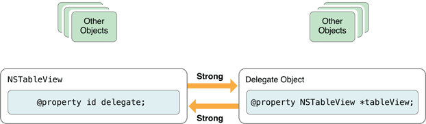
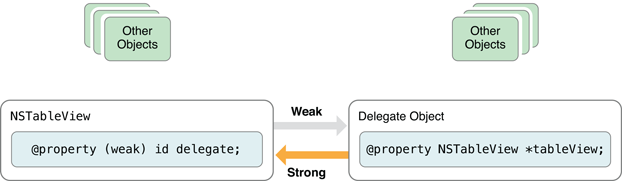

### bloomberg:
1. Find the missing integer in an array of integers.  (sum minus)
2. Given an array of numbers, find the 2 two largest numbers in the array (hashmap)
3. How HashMap implemented in Java?
http://javahungry.blogspot.com/2013/08/hashing-how-hash-map-works-in-java-or.html

4. The two-sum problem (hashmap)
5. Remove duplicates from an unsorted singly linked list.
6. Languages: Different between Java and C++, garbage collector in java (how it work), static vs dynamic memory allocation - Data structures: Linked lists, queues, stacks, heap, trees - OOP: polymorphism, design patterns that I used before - Algorithms: Sorting algorithms I know and there complexity, how to search for a number in an array (sorted and not sorted cases) - Coding question: reverse a singly linked list  
7. What is the role of the JVM ?  A Java virtual machine (JVM), an implementation of the Java Virtual Machine Specification, interprets compiled Java binary code (called bytecode) for a computer's processor (or "hardware platform") so that it can perform a Java program's instructions. Java was designed to allow application programs to be built that could be run on any platform without having to be rewritten or recompiled by the programmer for each separate platform. A Java virtual machine makes this possible because it is aware of the specific instruction lengths and other particularities of the platform.
8. What are the primitive data types in Java? What is the JVM and the Garbage Collector? Implement a method to decide whether a string is palindrome or not.  
	int, double, byte short, long, float, boolean, char.
9. What is Java Garbage Collection; Difference between an interface and an abstract class

### Microsoft:
1. Design an algorithm for parsing code to check whether all the brackets and parentheses match.
2. Given an array, find the value which is larger than all the values with smaller indexes, and smaller than all the values with larger indexes. (2-pass DP)
3. Describe recursion to a 5 year old child
4. reverse the order of words in a string.
5. Design a function to reverse a linked list.
6. 一面对基础知识进行考察，然后问算法写代码，一个是单链表删除倒数M个节点，一个是把二叉树保存到文件中，并从文件中读出并恢复二叉树。
二面问得比较水，求素数的算法，然后对可能出现的情况，进行了扩展。
三面是写个求两个字符串，最长公共子串的算法

### Keep: iOS developer
1. @property + key words. Usage, difference
	2. Atomic: atomic(保证setter／getter的原子性，为操作执行期间添加互斥锁，保证多线程情况下对变量的读写同步), nonatomic（不需考虑多线程情况，相对于 atomic 效率更高）。By default, an Objective-C property is atomic。[http://my.oschina.net/linxiaoxi1993/blog/381332](http://my.oschina.net/linxiaoxi1993/blog/381332)
	3. Read／Write Authorisation：readwrite（default），readonly
	4. Memory management. ARC（Automatic Reference Count):
		
[http://www.lvtao.net/ios/504.html](http://www.lvtao.net/ios/504.html)

Official document(_Long but highly recommend to read_): [https://developer.apple.com/library/mac/documentation/Cocoa/Conceptual/ProgrammingWithObjectiveC/EncapsulatingData/EncapsulatingData.html](https://developer.apple.com/library/mac/documentation/Cocoa/Conceptual/ProgrammingWithObjectiveC/EncapsulatingData/EncapsulatingData.html)
		5. strong（default），weak：When use strong(keep the object alive), should be carful about **Strong Reference Cycles**(Lead to memory leak)

	@property (weak) id delegate;
	NSObject * __weak weakVariable;

- A weak reference is automatically set to nil when its object is deallocated. 

	if (self.someWeakProperty) { //Make sure a weak property is not nil before using it.
	        [someObject doSomethingImportantWith:self.someWeakProperty];
	}
	6. assign, retain:
		- retain: similar with strong
		- assign: similar with weak, but will not automatically set to nil
	
	7. copy: In some circumstances, an object may wish to keep its own copy of any objects that are set for its properties.
	@property NSString *firstName;

	NSMutableString *nameString = [NSMutableString stringWithString:@"John"];

	self.badgeView.firstName = nameString;

	[nameString appendString:@"ny"]; //firstName will change,
	
	@property (copy) NSString *firstName;// So should declear with (copy)
	7. Accessor Method：
		@property (getter=isFinished) BOOL finished;
	- Usually do not recommend rewrite setter method.
	- In general, you should use accessor methods or dot syntax for property access even if you’re accessing an object’s properties from within its own implementation, in which case you should use self. The **exception** to this rule is when writing **initialisation, deallocation or custom accessor methods**.
		
		_propertyName = xx; //System default set name

		@synthesize propertyName = yourOwnName; //If you want to change
		
		@synthesize propertyName; //The instance variable will bear the same name as the property, without underscore
	8. Not in common use: nonnull,null\_resettable,nullable

1. Compile process：
	2. Pre-process
2. run time/run loop
3. http state number 2xx, 4xx, 5xx
4. http get/post difference
5. git workflow
6. git command

8. MVC -\> MVVM
9. third party library
10. favorite website / book / blog, your note and review
11. design pattern you’ve used

